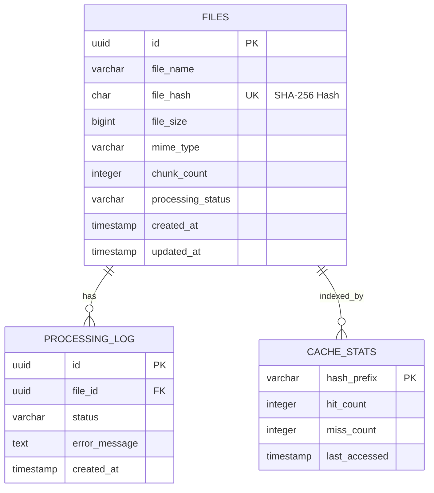

# System Architecture Diagrams

This document contains visual representations of the file de-duplication system architecture.

## High-Level Architecture

## Duplicate Detection Flow

## Database Schema Design

## Microservice Architecture

## Deployment Architecture

## Security Architecture

## Scaling Strategy

## Performance Monitoring Dashboard

