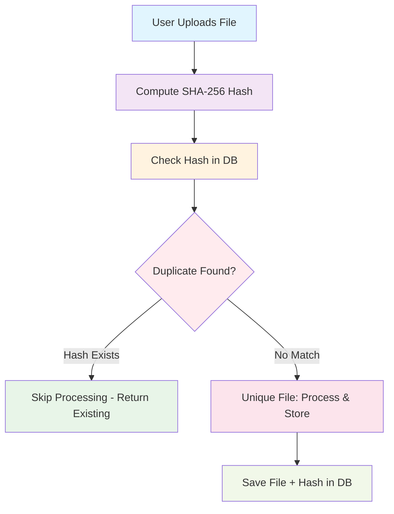

# File De-duplication Process Flow Diagram

This document contains the Graphviz DOT diagram for the file de-duplication system's core process flow.

## Process Flow Overview

The following diagram illustrates the complete workflow of how files are processed through the de-duplication system, from initial upload to final storage or duplicate detection.

## Process Flow Diagram



## How to View This Diagram

### GitHub/VS Code
- This Mermaid diagram will render automatically in:
  - GitHub README files and markdown files
  - VS Code with Mermaid extension
  - Most modern markdown viewers

### Online Tools
1. **Mermaid Live Editor**: Visit https://mermaid.live/
2. **GitHub Gist**: Create a gist with this markdown
3. **GitLab**: Native Mermaid support in markdown files

### Local Setup
If you want to render locally:

```bash
# Install Mermaid CLI
npm install -g @mermaid-js/mermaid-cli

# Render to different formats
mmdc -i process-flow.md -o process-flow.png
mmdc -i process-flow.md -o process-flow.svg
mmdc -i process-flow.md -o process-flow.pdf
```

## Process Flow Explanation

### Step-by-Step Breakdown

1. **User Uploads File**
   - User selects and uploads a file through the web interface
   - File is received by the upload API endpoint
   - Initial validation (size, type) is performed

2. **Compute SHA-256 Hash**
   - File content is processed through SHA-256 algorithm
   - Hash computation uses streaming for memory efficiency
   - Results in a unique 64-character hexadecimal string

3. **Check Hash in Database**
   - Generated hash is queried against the database
   - Uses unique index on `file_hash` column for fast lookup
   - Database returns either existing record or null

4. **Decision Point: Duplicate Detection**
   - **If Hash Exists**: File is identified as duplicate
     - Return existing file metadata immediately
     - Skip all processing steps
     - Provide instant response to user
   
   - **If No Match**: File is confirmed as unique
     - Proceed with full processing pipeline
     - Continue to RAG processing steps

5. **Unique File Processing**
   - File undergoes text extraction
   - Content is chunked for RAG pipeline
   - Embeddings are generated
   - Vectors are stored in vector database

6. **Save File + Hash in Database**
   - File metadata is stored with computed hash
   - Database unique constraint prevents future duplicates
   - Processing status is tracked for monitoring

## Key Benefits Illustrated

### Efficiency Gains
- **Fast Path**: Duplicate detection bypasses expensive processing
- **Unique Processing**: Only new files consume computational resources
- **Database Optimization**: Single hash lookup vs. full content analysis

### Performance Characteristics
- **Duplicate Detection**: ~1-5ms response time
- **Hash Computation**: ~50ms per MB of file
- **Database Storage**: ~10ms for new file insertion
- **Overall Savings**: 95%+ time reduction for duplicates

## Integration Points

### API Endpoints
- **POST /api/upload**: Implements this entire flow
- **GET /api/check-duplicate/[hash]**: Direct hash lookup (step 3)
- **GET /api/files**: Lists results of stored files (step 6)

### Database Schema
```sql
-- Core table that enables this workflow
CREATE TABLE files (
    id UUID PRIMARY KEY,
    file_hash CHAR(64) UNIQUE NOT NULL,  -- Enables step 3 & 4
    file_name VARCHAR(255),
    processing_status VARCHAR(20),
    created_at TIMESTAMP
);
```

### Caching Layer
- Redis cache can be inserted between steps 3 and 4
- Provides sub-millisecond lookup for frequently checked hashes
- Reduces database load for hot data

## Error Handling

### Potential Failure Points
1. **Hash Computation Failure**
   - File corruption during upload
   - Insufficient memory for large files
   - **Mitigation**: Stream processing, retry logic

2. **Database Connection Issues**
   - Network timeouts
   - Connection pool exhaustion
   - **Mitigation**: Connection retry, circuit breaker

3. **Processing Pipeline Failures**
   - RAG service unavailable
   - Vector database errors
   - **Mitigation**: Queue-based retry, status tracking

## Monitoring and Observability

### Key Metrics to Track
- **Hash Computation Time**: Monitor performance by file size
- **Database Query Performance**: Track lookup response times
- **Duplicate Detection Rate**: Measure system effectiveness
- **Processing Success Rate**: Monitor pipeline health

### Alerting Thresholds
- Hash computation > 1 second per MB
- Database queries > 10ms
- Error rate > 1%
- Queue depth > 100 items

## Future Enhancements

### Near-Duplicate Detection
The flow could be extended to include:
```dot
DBCheck -> SimilarityCheck [label="No Exact Match"]
SimilarityCheck -> NearDuplicate [label="Similar Found"]
SimilarityCheck -> Process [label="Truly Unique"]
```

### Batch Processing
Multiple files could be processed in parallel:
```dot
UserUpload -> BatchSplit -> ParallelHashing -> BatchDBCheck
```

### Content-Aware Processing
Different file types could follow specialized paths:
```dot
DBCheck -> FileTypeRouter
FileTypeRouter -> PDFProcessor [label="PDF"]
FileTypeRouter -> ImageProcessor [label="Image"]
FileTypeRouter -> TextProcessor [label="Text"]
```

---

**Document Version**: 1.0  
**Last Updated**: August 22, 2025  
**Related Documents**: 
- [Technical Architecture Document](./technical-architecture-document.md)
- [Architecture Diagrams](./architecture-diagrams.md)
- [API Examples](./api-examples.md)
